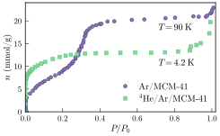
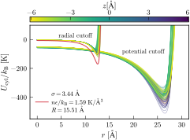

# Dimensional Reduction of Helium-4 Inside Argon Plated MCM-41 Nanopores
Nathan Nichols, Timothy R. Prisk, Garfield Warren, Paul Sokol, and Adrian Del Maestro

FIXME [arXiv:1602.04225](https://arxiv.org/abs/1602.04225)

### Abstract
The angstrom-scale coherence length describing the superfluid wavefunction of $^4$He at low temperatures has prevented its preparation in a truly one-dimensional geometry.  Mesoporous ordered silica-based structures such as the molecular sieve MCM-41 offer a promising avenue towards physical confinement, but the minimal pore diameters that can be chemically synthesized have proven to be too large to reach the quasi-one-dimensional limit.  We present an active nano-engineering approach to this problem by pre-plating MCM-41 with a single, well controlled layer of Ar gas before filling the resulting pores with helium.  The experimental adsorption isotherms and neutron scattering results are utilized to inform large scale quantum Monte Carlo simulations. The results demonstrate angstrom and kelvin scale tunability of the effective confinement potential experienced by $^4$He atoms inside the MCM-41, with the Ar layer reducing the diameter of the confining media into a regime where a number of solid layers surround a one-dimensional quantum liquid.

### Description
This repository includes links, code, scripts, and data to generate the figures in a paper.

### Requirements
The [data](Data/) in this project was generated via path integral quantum Monte Carlo
simulations peformed in the grand canonical ensemble using our
[open source code](https://code.delmaestro.org/) and through experiments carried
out using the [Disc Chopper Spectrometer (DCS)](https://www.nist.gov/ncnr/dcs-disk-chopper-spectrometer)
at the NIST Center for Neutron Research.

[Notebooks](Notebooks/) require [Jupyter](https://jupyter.org/) with at least
[Python 3.7](https://www.python.org/) and [Julia 1.4.1](https://julialang.org/)
with the appropriate [Jupyter kernel](https://github.com/JuliaLang/IJulia.jl) installed.
Additional dependencies may be easily determined on a per notebook basis.

### Support
The creation of these materials was supported in part by the National Science Foundation under Award Nos. DMR-1808440 and DMR-1809027.

### Figures

#### Figure 01: Experimental adsorption isotherms

#### Figure 02: Neutron scattering

#### Figure 03: Projection of MCM-41 supercell

#### Figure 04: Effective manybody potential

#### Figure 05a: Helium interacting with argon shell

#### Figure 05b: Effect of density on minima location and potential well depth

#### Figure 06: Relationship between pressure and chemical potential for bulk helium

#### Figure 07: QMC adsorption isotherms

#### Figure 08: Radial density of helium in Ar preplated MCM-41

#### Figure 09: Linear density of inner core and coverage of layers

#### Figure 10: Central slice of confinement potential for helium inside MCM-41 

#### Figure 11: Comparison of fitting methods to determine effective potential 

#### Figure 12: Finite size effects on radial density 

#### Figure 13: Finite size effects on inner core

#### Figure 14: Effects of the finite imaginary time step

